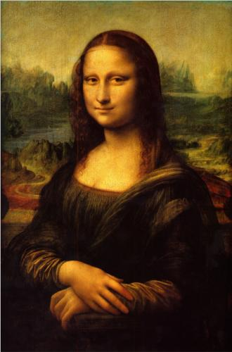
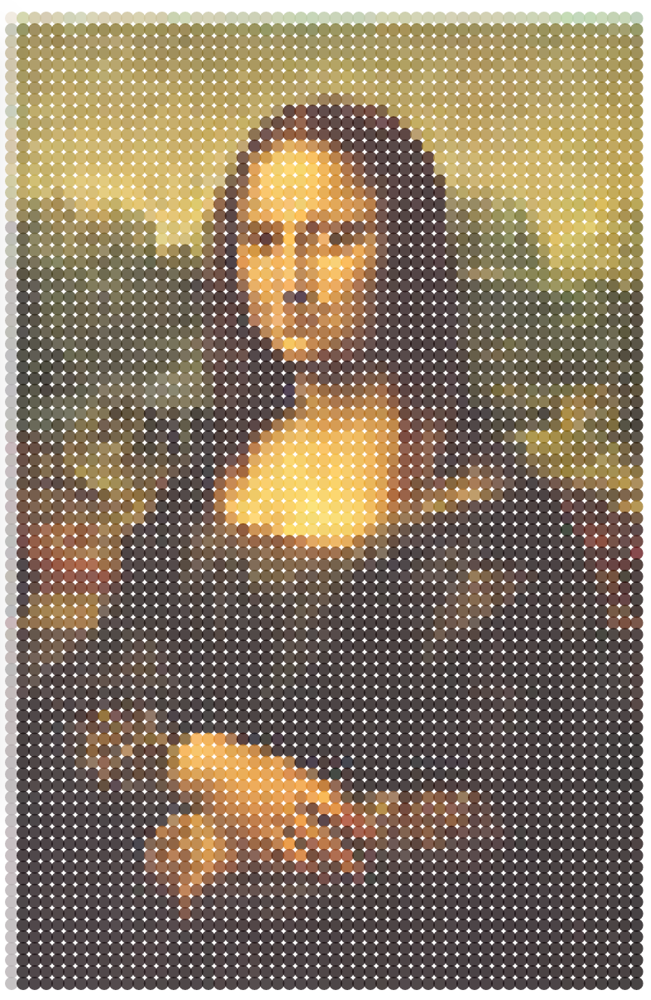

Pseudo-Pointillism
=================

Converts images to "pseudo-pointillist" versions using Python and D3.

A python backend using flask and pandas extracts position and color information from the pixels in an image and sends the results to the frontend to be rendered using dots in D3. 

<em>Example</em>:

 becomes  